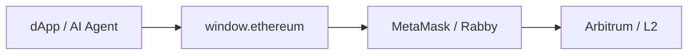
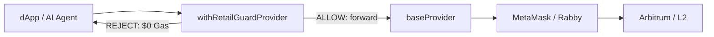
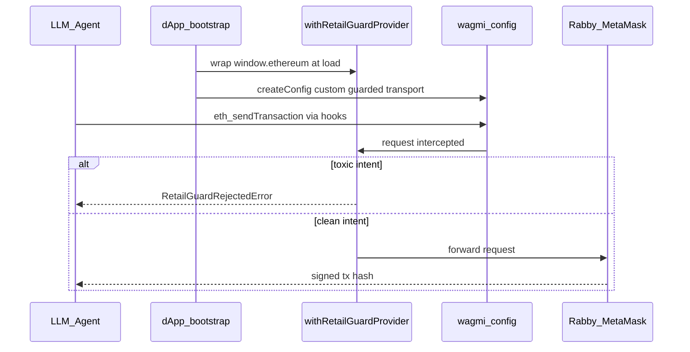
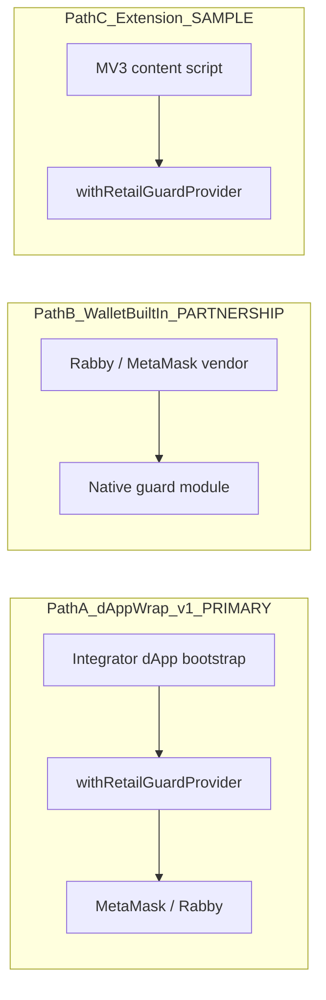

# Wallet Integration & Install Guide

> **TL;DR:** End users do **not** install a new wallet. Integrators wrap existing MetaMask / Rabby once at dApp bootstrap with `withRetailGuardProvider()`. Judges verify via terminal — no browser required. Details below.

**Audience:** Buildathon judges · wallet integrators · grant evaluators  
**Package:** `@slivervine/exomesh-agentic-wallet-guard` · `withRetailGuardProvider()`  
**Related:** [01_SDK_INTEGRATION_BLUEPRINT.md](./01_SDK_INTEGRATION_BLUEPRINT.md) · [02_EXOMESH_PROVIDER_GUARD_SPEC.md](./02_EXOMESH_PROVIDER_GUARD_SPEC.md) · [JUDGE_BRIEF.md](../../../JUDGE_BRIEF.md)

---

## Who Installs What

| Role | Action | Do **not** say |
|------|--------|----------------|
| **End user** | Keeps existing MetaMask / Rabby / Coinbase Wallet — no new app | "Install SliverVine wallet" |
| **Integrator** (dApp / protocol / agent harness) | One-line wrap at app bootstrap before any `request()` | "Users must switch wallets" |
| **Judge / evaluator** | Clone repo · terminal demos + Vitest — **no browser required** | "npm install from registry" (package is `private: true` post-grant) |

**This is middleware, not a consumer wallet.** Integrators import the SDK; end users never "install SliverVine Protocol."

---

## Wallet Compatibility

Any **EIP-1193** injected provider works — same wrap, same intercept path:

| Wallet | Injection | Notes |
|--------|-----------|-------|
| **MetaMask** | `window.ethereum` | Primary judge narrative |
| **Rabby** | `window.ethereum` (or EIP-6963 `rdns: io.rabby`) | Same wrap; built-in vendor path = partnership GTM (not shipped) |
| **Coinbase Wallet** | `window.ethereum` / EIP-6963 | Same wrap |
| **WalletConnect** | Injected bridge provider object | Wrap the provider instance, not the WC modal |
| **Viem** | `createWalletClient({ transport: custom(guardedEthereum) })` | Pass guarded provider as custom transport |
| **wagmi** | `createConfig({ transports: { [chainId]: custom(guardedEthereum) } })` | Wire guarded provider at config bootstrap |

### Minimal wrap (all wallets)

```ts
import { withRetailGuardProvider } from "@slivervine/exomesh-agentic-wallet-guard";

const guardedEthereum = withRetailGuardProvider(window.ethereum, {
  allowedSpenders: [/* router addresses */],
  allowedVenues: [/* EIP-712 verifyingContract allowlist */],
});

await guardedEthereum.request({ method: "eth_sendTransaction", params: [tx] });
// REJECT → RetailGuardRejectedError · $0 Gas · never broadcast
```

### Viem

```ts
import { createWalletClient, custom } from "viem";
import { arbitrum } from "viem/chains";

const client = createWalletClient({
  chain: arbitrum,
  transport: custom(guardedEthereum), // guardedEthereum from wrap above
});
```

### wagmi v2 (bootstrap once)

```ts
import { createConfig, custom } from "wagmi";
import { arbitrum } from "wagmi/chains";

export const config = createConfig({
  chains: [arbitrum],
  transports: { [arbitrum.id]: custom(guardedEthereum) },
});
// Agent / dApp code uses wagmi hooks — never raw window.ethereum
```

**Intercepted methods** (pre-sign, 0-Gas on reject): `eth_sendTransaction` · `eth_signTypedData_v4` · `wallet_sendCalls` (EIP-5792) — see [provider.ts](../../../src/sdk/exomesh-agentic-wallet-guard/provider.ts).

---

## Diagram A — Today (unguarded)



Toxic calldata reaches the wallet signing UI with no pre-consensus gate.

---

## Diagram B — Correct wiring (v1.0 primary)



Integrator wraps **once** at bootstrap. All agent traffic must use the guarded handle.

---

## Diagram C — wagmi + Agent (three-party)



---

## Three Go-to-Market Integration Paths



| Path | Who wires | Shipped today? | Proof |
|------|-----------|----------------|-------|
| **A — dApp-side wrap** | Protocol / dApp dev at bootstrap | **Yes** — primary SKU | `pnpm demo:exomesh` · **254/1206** Vitest |
| **B — Wallet built-in (e.g. Rabby)** | Wallet vendor embeds guard in extension binary | **No** — B2B licence / post-grant partnership | GTM option only — not a v1.0 claim |
| **C — Browser extension sample** | User load-unpacked or vendor forks sample | **Scaffold only** — [src/extension/](../../../src/extension/README.md) | `pnpm build:extension` · **not** Chrome Web Store |

**Path A** = judge eval · **Path B** = Rabby-style vendor partnership (not shipped) · **Path C** = MV3 sample → [01_DELIVERABLES_AND_PROOFS.md](../../03_product_verifications/03_DELIVERABLES_AND_PROOFS.md) Lane 3.

**Honesty:** npm `"private": true` (clone repo) · raw `window.ethereum` bypasses guard · extension = scaffold only · not Blockaid RPC proxy · `withExoMeshShield()` ≠ wallet wrap.

---

## Judge Quickstart (no browser)

```bash
pnpm demo:exomesh && pnpm demo:exomesh -- --trip && pnpm demo:gmx -- --trip
npx vitest run tests/sdk/retail-guard-provider.test.ts  # 35/35
```

→ [JUDGE_BRIEF § Judge 60s](../../../JUDGE_BRIEF.md)

## Integrator Quickstart (browser)

1. Wrap at bootstrap: `withRetailGuardProvider(window.ethereum, config)`
2. Pass guarded handle to Viem `custom()` or wagmi `createConfig`
3. Never expose raw `window.ethereum` to agent tool code

→ [examples/eip1193-provider-demo.ts](../../../examples/eip1193-provider-demo.ts) · `pnpm demo:exomesh`

| Say | Don't say |
|-----|-----------|
| "Wrap MetaMask / Rabby at signing boundary" | "Install SliverVine Protocol" |
| "Integrator wires once" | "Rabby already ships our guard" |
